# 04. 커넥션 관리

**HTTP 가 TCP 커넥션을 사용하는 다양한 방법들과 그것들이 성능에 어떻게 영향을 주는지, 성능 최적화를 위해 무엇을 알아야 하는지를 살펴봅니다**

## 4.1 TCP 커넥션

* 현재 전 세계 대부분의 HTTP 통신은 TCP/IP 프로토콜을 통해 이루어지고 있다
* HTTP 커넥션을 다루기 위해서는 TCP 의 동작에 대해 자세히 알아야 한다

  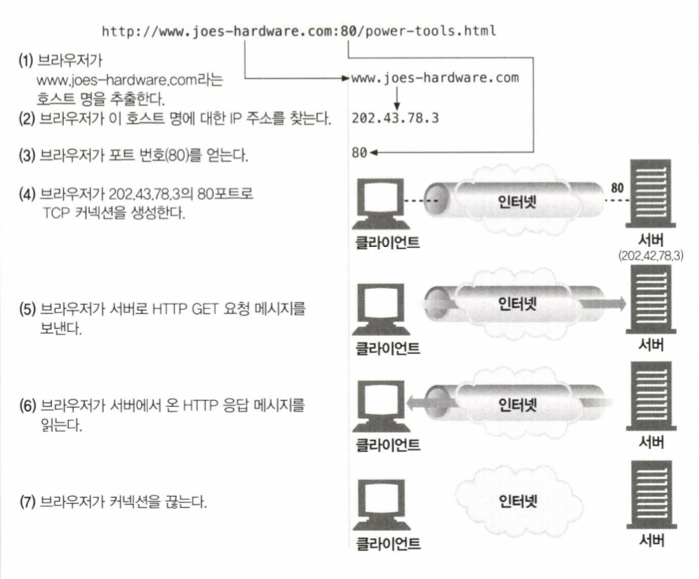

  > HTTP 요청에 따른 TCP 커넥션 동작

### 신뢰할 수 있는 데이터 전송 통로인 TCP

* HTTP 프로그래머는 TCP/IP 계층에서 무슨 일이 일어나는지 보이지 않는다 

  [TCP 소켓 프로그래밍](https://github.com/jeuxdeau/http-the-definitive-guide/blob/master/i.http-the-webs-foundation/04.connection-management/README.md#tcp-%EC%86%8C%EC%BC%93-%ED%94%84%EB%A1%9C%EA%B7%B8%EB%9E%98%EB%B0%8D)

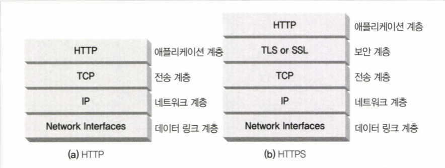

> HTTP 와 HTTPS 네트워크 프로토콜 스택 추상화된 계층 구조를 통해 하위, 상위 프로토콜의 동작에 대해 알지 못해도 통신이 가능하도록 설계되었다

* IP 패킷은 TCP 세그먼트를 포함하고 있다

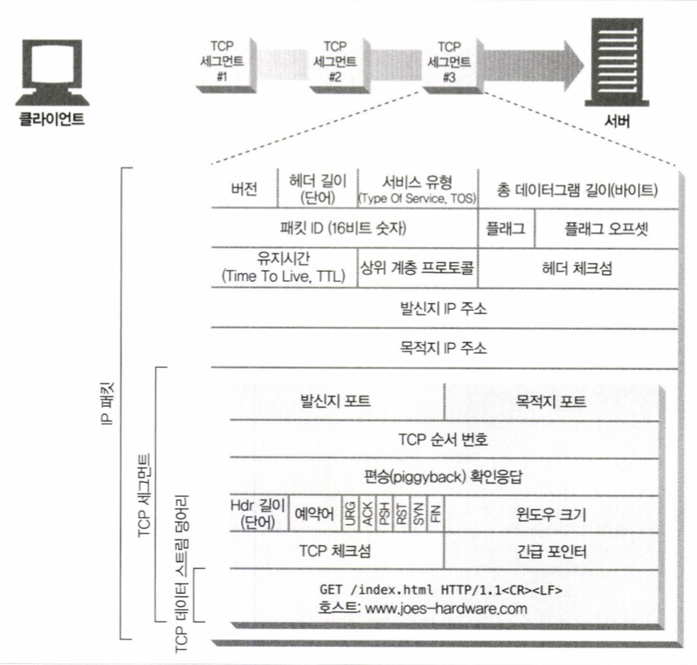

> IP 패킷의 구조 TCP 세그먼트는 IP 패킷에 담겨 네트워크 상에 나가게 된다

### TCP 커넥션 유지하기

* TCP 커넥션은 네 가지 값으로 식별될 수 있다
* 다음의 값들 중 하나라도 다르다면 두 커넥션은 서로 다른 커넥션이다
  * Source IP Address
  * Source port
  * Destination IP Address
  * Destination port

    **TCP 소켓 프로그래밍**
* 운영체제에서 제공하는 TCP 소켓 API 들은 HTTP 프로그래머에게 TCP 와 IP 의 세부사항을 알지 못해도 TCP 커넥션을 이용할 수 있게 해준다

  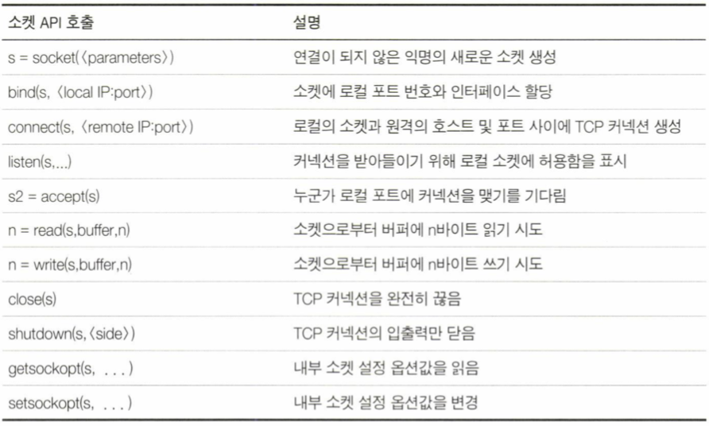

  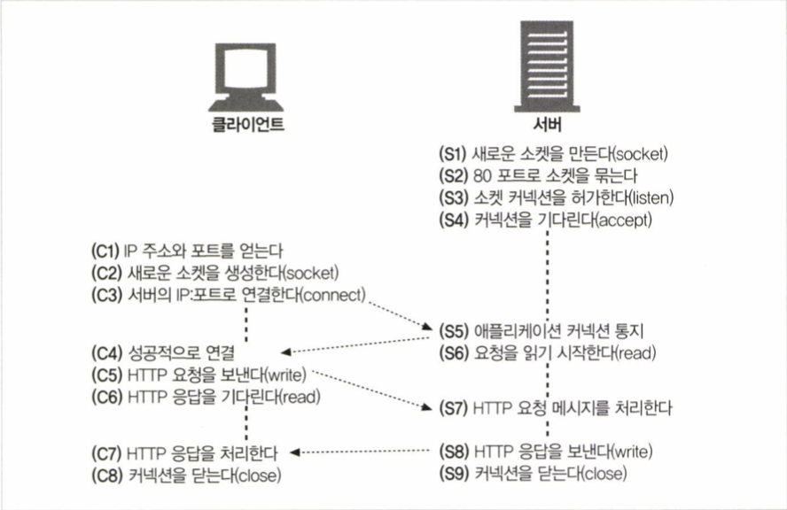

> TCP 공용 소켓 인터페이스 함수 소켓 API 를 통해 handshake, segmenting, segment and reassembly 등등 구현에 대한 세부사항을 외부로부터 숨긴다

## 4.2 TCP의 성능에 대한 고려

* TCP 성능은 HTTP 의 성능에 직접적인 영향을 준다
* HTTP 트랜잭션 시간에 영향을 주는 요소들
  * TCP 커넥션 설정
  * 요청 전송
  * 요청 처리
  * 응답 전송

    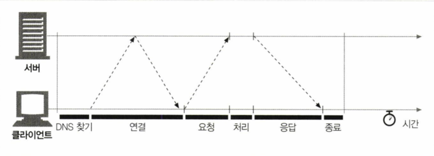

    > 하나의 HTTP 트랜잭션 처리에 드는 시간 실제 요청을 처리하는 시간에 비해 TCP 네트워크 지연이\(커넥션 연결, 요청, 응답\) 훨씬 큰 것을 볼 수 있다

### TCP 성능 관련 중요 요소

* TCP handshake 설정
  * TCP 프로토콜은 연결 설정을 위한 초기 3-way handshake 과정을 필요로 한다

    

    > 3-way handshake sequence 모든 연결 시 거쳐야하는 과정이기 때문에 크기가 작은 HTTP 트랜잭션은 tcp handshake 로 인한 오버헤드가 부담이 될 수 있다

#### TCP status diagram

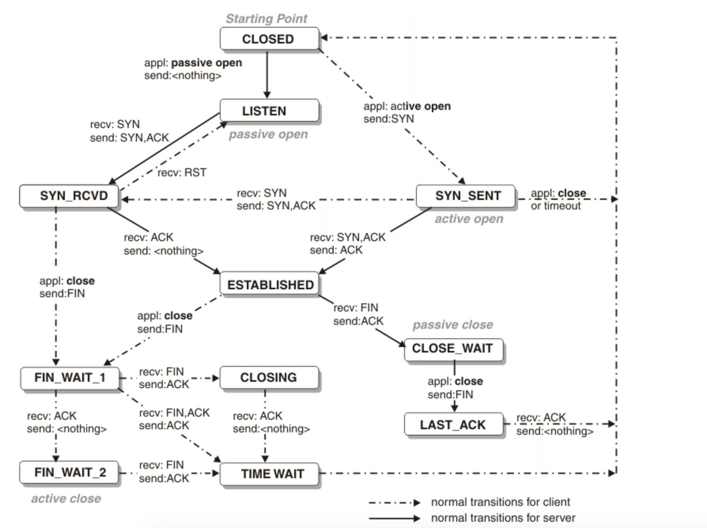

> TCP Fast Oepn \([TCP Fast Open - Wikipedia](https://en.wikipedia.org/wiki/TCP_Fast_Open)\)
>
> * Client 에서 SYN + TFO cookie request 을 보내고 서버는 SYN + ACK + TFO cookie 를 응답으로 보낸다 -&gt; 1RTT
> * 이후 Client 는 TFO cookie 로 암호화된 데이터와 함께 SYN 을 보내며 서버와 3-way handshake 를 진행한다 -&gt; handshake 중 데이터 교환이 가능

* slow start
  * TCP 프로토콜은 현재 네트워크 망의 혼잡 상태를 확인하여 한번에 전송하는 패킷의 양을 조절하는 알고리즘이 존재한다 \(tcp congestion control\)
  * congestion window 의 크기는 1부터 시작하여 임계값에 도달할 때 까지 2의 지수배로 증가한다 \(이후 1씩 증가\)
  * 기존의 커넥션은 새로 생성된 커넥션에 비해 현재 네트워크 망의 혼잡 상태에 맞춰 congestion window 의 튜닝이 완료된 상태이기 때문에 더 효율적인 데이터 전송이 가능하다

#### TCP congestion control

## 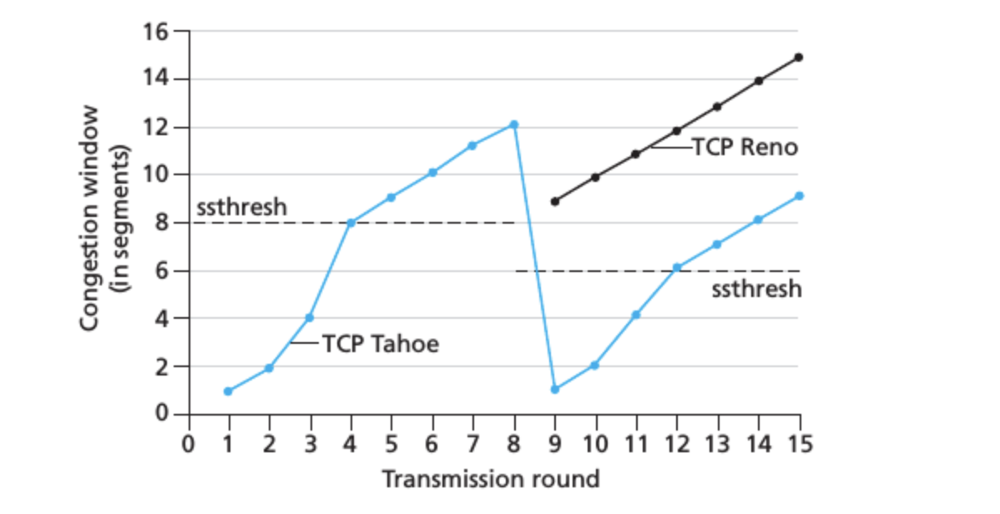

* nagle algorithm
  * TCP 세그먼트는 40바이트 상당의 헤더를 포함하기 때문에 아주 작은 크기의 데이터를 전송하면 오버헤드로 인한 부하가 증가할 수 있다
  * nagle algorithm 은 세그먼트가 ack 를 수신하거나 혹은 충분한 크기가 되기 전까지 전송하지 않고 데이터를 쌓아두었다가 전송한다
* piggyback ack
  * TCP 프로토콜은 신뢰성 있는 전송을 보장하기 위해 ARQ 프로토콜을 사용한다
  * 하나의 ack \(확인응답\) 메세지만을 전달하기 위한 오버헤드를 줄이기 위해 같은 방향으로 송출되는 데이터 패킷에 ack 를 편승\(piggyback\) 시킬 수 있다
    * 특정 시간 \(보통 0.1 ~ 0.2 sec\) 동안 버퍼에 ack 를 저장해두고 해당 방향의 데이터 패킷이 있다면 편승
  * HTTP 는 요청 - 응답 방식이기 때문에 일반적으로 새로운 요청이 없다면 해당 방향으로 송출되는 데이터 패킷을 찾기 어렵고, piggyback ack 를 활용할 기회가 줄어든다
    * nagle algorithm 과 함께 사용될 경우 ack 가 오기 전까지 데이터를 버퍼에 쌓아두고있는 동안, 다른 쪽은 ack 를 버퍼에 쌓아두는 동작을 하기 때문에 주의해서 사용해야 한다
* TIME\_WAIT 지연과 포트 고갈
  * TCP 커넥션이 종료된 후 곧바로 같은 IP adress 와 port 를 사용하는 커넥션이 생성될 경우, 뒤늦게 도착한 이전 커넥션의 패킷이 존재할 경우 데이터 충돌이 발생할 수 있다
  * 커넥션이 종료된 후, 이전 커넥션의 IP adress 와 port 를 TCP control block 에 저장해놓는다
    * 일반적으로 2MSL \(Max Segment Lifetime - 약 1분\)
  * 현재는 라우터들의 성능이 향상되 중복 패킷이 발생하는 경우는 거의 없다
  * TIME\_WAIT 상태의 소켓을 재사용할 수 있도록 하는 옵션들도 

#### TIME\_WAIT 소켓 재사용

* Linger 구조체 옵션
  * LINGER.l _onoff   / LINGER.l_ linger
    * 1 / 0 일때 buff 에 남은 데이터 다 버리고 time wait 없이 종료 \(비정상종료\)
    * 1/ non-zero 일때 timeout 기다렸다가 종료 \(비정상종료\)
    * 0 일때 백그라운드에서 버퍼 비우고 종료 \(default, 정상종료\)
* socket 옵션을 이용해 TIME\_WAIT 상태의 소켓을 바로 할당
  * SO\_REUSEADDER 
    * 서버 소켓에 적용되는 옵션
  * tcp\_ tw\_reuse 
    * 클라이언트 소켓에 적용되는 옵션
* **\(1\) 애플리케이션에서 connection pool을 사용**
  * 성능과 유연성면에서 가장 추천하는 방법이지만, 애플리케이션을 고쳐야 합니다.
* **\(2\) TW\_REUSE 옵션을 사용**
  * 사용할 수 있는 local port 수가 모자라면, 현재 TIME\_WAIT 상태의 소켓 중 프로토콜상 사용해도 무방해 보이는 소켓을 재사용합니다.
* **\(3\) TW\_RECYCLE 옵션을 사용**
  * TIME\_WAIT 상태에 머무르는 시간을 변경하여 TIME\_WAIT 상태의 소켓 수를 줄입니다. 1분 대신 RTO\(Retransmission Timeout\) 시간만큼으&gt; 로 TIME\_WAIT 상태에 머무르는 시간이 경감되는데, 리눅스에서는 200ms까지 이 시간이 줄 수 있습니다. \(최소 RTO가 200ms\)
* **\(4\) Socket linger 옵션을 굉장히 짧은 시간을 매개변수로 주어 사용**
  * FIN 대신 RST를 보내게 유도하며, 이 때 소켓을 파괴하여 소켓이 TIME\_WAIT 상태에 머무르지 않게 합니다.

## 4.3 HTTP 커넥션 관리

### 흔히 잘못 이해하는 Connection 헤더

* HTTP 는 클라이언트와 서버 사이 프록시와 캐시와 같은 중개 서버를 허용한다
* HTTP 의 Connection 헤더는 인접한 HTTP 어플리케이션 사이의 커넥션에만 적용될 옵션을 지정할 수 있게 해준다

  > Connection 헤더에 전달할 수 있는 세가지 토큰
  >
  > * HTTP 헤더 필드 이름
  >   * 이 커넥션에만 해당되는 헤더들을 나열 \(hop-by-hop\)
  >     * 특정 두 서버에만 영향 
  >
  >       \(Proxy-Authenticate, Proxy-Connection, Trasfer-Encoding, Upgrade 등의 헤더도 동일하게 취급되야 함\)
  >   * 다음 커넥션에 전달 시 삭제해서 전달해야 함
  > * 임시 토큰 값
  >   * 커넥션에 대한 비표준 옵션
  > * close
  >   * 현재 작업 완료 후 커넥션 종료
  >
  >     **순차적인 트랜잭션 처리에 의한 지연**

* 커넥션 관리가 제대로 이루어지지 않으면 하나의 리소스 당 하나의 커넥션을 새로 생성해야 할 수도 있기 때문에 성능이 떨어질 수 있다
  * 다른 리소스 객체에 의존적인 리소스 객체가 존재하는 경우 의존 리소스를 모두 내려받기 전까지 아무 동작도 하지 않는 경우도 발생할 수 있다

## 4.4 병렬 커넥션

* 여러개의 리소스를 요청할 경우, 한번에 여러개의 커넥션을 생성해서 병렬로 내려받을 수 있게 한다

  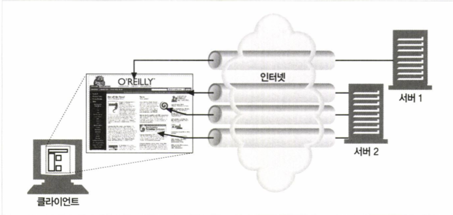

  > 4개의 컴포넌트 리소스를 필요로 하는 웹 페이지에서 동시에 4개의 커넥션을 생성하여 병렬로 내려받을 수 있다
  >
  > ### 병렬 커넥션은 페이지를 더 빠르게 내려받는다

* 각각의 리소스를 내려받는데 필요한 지연시간이 겹치기 때문에 전체 지연시간이 줄어든다

  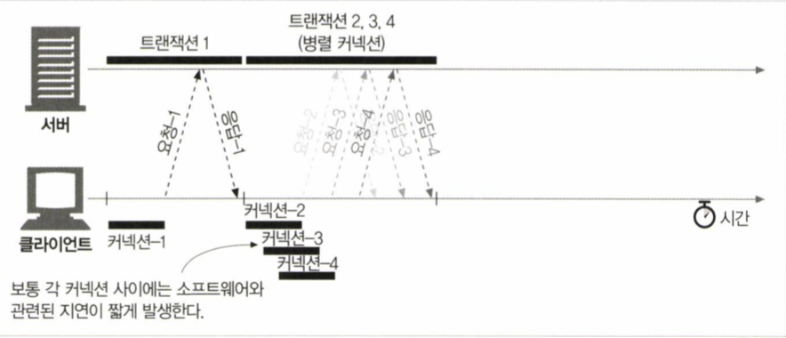

  > HTML 페이지를 내려받은 뒤 로드 할 이미지 리소스 3개를 병렬 커넥션으로 동시에 처리한다
  >
  > ### 그렇다고 병렬 커넥션이 항상 더 빠르지는 않다

* 클라이언트의 인터넷 대역폭이 충분해야 한다
  * 부족한 대역폭에서 동시에 여러 커넥션에서 전송을 시도하면, 패킷 손실로 인한 재전송과 혼잡제어 알고리즘에 따라 오히려 더 느려질 수 있다
* 커넥션을 생성하는데 소모되는 부하가 성능을 감소시킬 수 있다
* 일반적으로 서버 입장에서는 한번에 여러 클라이언트들의 요청을 처리해줘야 하기 때문에 단일 클라이언트의 병렬 커넥션 수를 제한하고 있다 \(보통 4개\)

  **병렬 커넥션은 더 빠르게 느껴질 수 있다**

* 사용자 경험 측면에서는 최종적으로 페이지가 렌더링 되는데 소요되는 시간이 동일하거나 더 오래걸린다고 하더라도, 여러 작업이 일어나는 과정을 눈으로 확인할 수 있으면 더 빠르다고 느껴질 수 있다

## 4.5 지속 커넥션

* 대부분의 웹 클라이언트는 사이트 지역성을 가진다
  * 웹 페이지에 첨부된 대부분의 리소스들은 보통 같은 웹 사이트에 있기 때문에 같은 서버로 또 요청하게 된다
* HTTP/1.1 에서는 처리가 완료된 TCP 커넥션을 바로 종료하지 않고 이어지는 HTTP 요청에 재사용할 수 있다
  * 이러한 TCP 커넥션을 지속 커넥션 \(Persistent Connection\) 이라고 함
* TCP handshake, slow start 로 인한 지연을 완화하여 더 빠른 데이터 전송이 가능하게 한다

  **지속 커넥션 vs 병렬 커넥션**

* 병렬 커넥션은 이러한 단점이 존재한다 [그렇다고 병렬 커넥션이 항상 더 빠르지는 않다](https://github.com/jeuxdeau/http-the-definitive-guide/blob/master/i.http-the-webs-foundation/04.connection-management/README.md#%EA%B7%B8%EB%A0%87%EB%8B%A4%EA%B3%A0-%EB%B3%91%EB%A0%AC-%EC%BB%A4%EB%84%A5%EC%85%98%EC%9D%B4-%ED%95%AD%EC%83%81-%EB%8D%94-%EB%B9%A0%EB%A5%B4%EC%A7%80%EB%8A%94-%EC%95%8A%EB%8B%A4)
* 지속 커넥션의 장점
  * 새로운 커넥션 수립에 드는 비용 감소
  * 커넥션 튜닝에 드는 비용 감소
  * 전체 커넥션의 수 감소
* 지속 커넥션의 단점
  * 계속 연결된 상태의 수많은 커넥션이 쌓이게 될 수 있음
  * 불필요한 서버, 클라이언트의 리소스 소모
* 지속 커넥션과 병렬 커넥션을 함께 사용하는 것이 가장 효과적이다
  * 적은 수의 병렬 커넥션을 지속 커넥션으로 맺어 사용

    **HTTP/1.0+ 의 Keep-Alive 커넥션**
* 연속 커넥션과 지속 커넥션

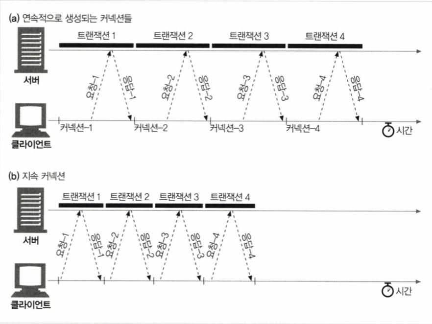

> 지속 커넥션은 연속 커넥션에 비해 커넥션 수립/해제에 필요한 비용을 줄여 좋은 성능을 보여준다
>
> ### Keep-Alive 동작
>
> * Keep-Alive 는 depreacted 되어 HTTP/1.1 명세에서 빠졌다
>   * 하지만 지금도 많이 사용되고 있음

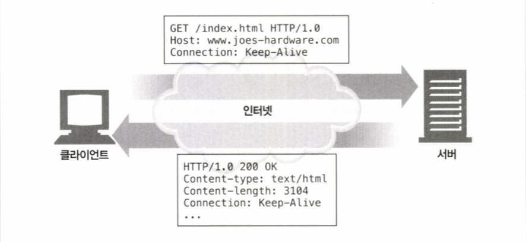

> Client가 요청에 Connection : Keep-Alive 헤더를 포함시킨다 Server 는 응답에 Connection : Keep-Alive 헤더를 내려보내는데, 존재하지 않으면 클라이언트는 서버가 지원하지 않으며 커넥션이 종료될 것으로 추정한다
>
> ### Keep-Alive 옵션
>
> * Keep-Alive 헤더는 요청일 뿐이며, 클라이언트와 서버 모두 따라야 할 강제성은 없다
>   * 언제든 Keep-Alive 커넥션을 끊고 제한할 수 있음
> * Keep-Alive 옵션들
>   * timeout
>     * 응답 헤더에 포함
>     * keep-alive 커넥션의 유지 시간
>     * 역시 보장하지는 않는다
>   * max 
>     * 응답 헤더에 포함
>     * keep-alive 커넥션이 처리할 수 있는 HTTP 트랜잭션 수
>     * 역시 보장하지는 않는다
>   * 기타 디버깅을 목적으로 하는 임의의 속성들도 존재한다
>   * Connection : Keep-Alive 헤더가 있을 때만 사용할 수 있다
>
>     **Keep-Alive 커넥션 제한과 규칙**
> * Connection : Keep-Alive 헤더가 없으면 사용되지 않는다 \(default 가 아님\)
> * 사용하려면 모든 HTTP 메세지에 Connection : Keep-Alive 헤더가 포함되야 한다
> * 응답 헤더의 Connection : Keep-Alive 여부를 통해 커넥션이 끊어질 지 판단할 수 있다
> * 정확한 Content-Length 값과 멀티파드 미디어 형식, 또는 chunked transfer encoding 으로 인코드 되어야 한다
>   * 연결이 지속되기 때문에 이전 메세지와 새로운 메세지의 경계를 정확히 알 수 있어야 하기 때문이다
> * 프록시와 게이트웨이는 Connection 헤더 규칙을 철저히 지켜야 한다
>   * 요청을 relay 하기 전 Connection 헤더와 관련된 모든 필드를 제거해야 한다 
> * 중개 서버에 Connection 헤더를 인식하지 못하는 프록시가 있다면 사용해선 안된다
> * HTTP/1.0 을 따르는 기기로부터 받는 모든 Connection 헤더 필드는 무시해야 한다
>   * 오래된 프록시 서버로부터 잘못 포함된 헤더가 있을 수 있다
> * 클라이언트는 전체 응답을 다 받기 전에 커넥션이 끊어졌을 경우 다시 요청을 보낼 수 있어야 한다
>
>   **Keep-Alive 와 멍청한 프록시**
>
> * 중개 서버는 요청을 전달할 때 Connection 헤더와 관련된 필드를 모두 제거해야 한다
> * Connection 헤더를 인식하지 못하는 중개 서버가 Connection 헤더를 포함시켜 요청을 전달하는 문제가 발생할 수 있다

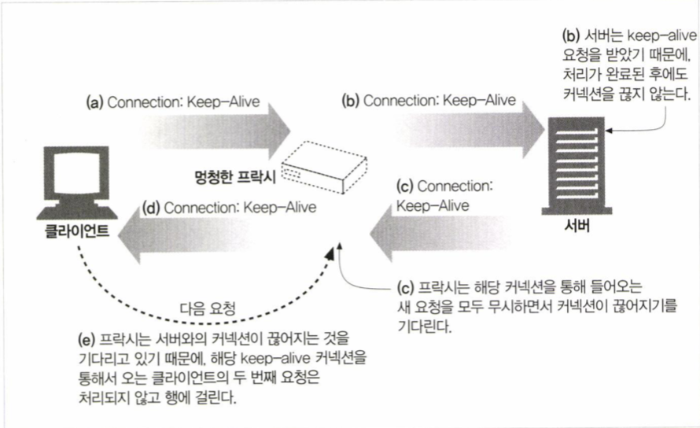

> 멍청한 프록시가 존재할 때 Connection: Keep-Alive 헤더가 포함된 요청을 날리면? 1. 클라이언트는 Connection : Keep-Alive 헤더를 포함한 요청을 날린다 2. 멍청한 프록시는 Connection 헤더를 단순한 확장 헤더로 인식하여 그대로 다음 서버로 전달한다
>
> * Connection 헤더는 hop-by-hop 헤더로 특정 두 서버 사이에서만 동작해야 함
>   1. 서버가 요청을 수락할 경우 프록시와 커넥션을 유지하기를 원하는 것으로 판단하고 Connection : Keep-Alive 규약에 따른 응답을 내려준다
>   2. 멍청한 프록시는 서버의 Connection 헤더를 그대로 클라이언트에 전달하고, 클라이언트는 프록시와 커넥션이 유지되는 것으로 생각하고 Keep-Alive 규약에 맞춰 요청을 보낸다
>   3. 하지만 멍청한 프록시는 Keep-Alive 를 전혀 모르기 떄문에 커넥션 종료를 기다리지만, 서버는 커넥션을 유지하는 것으로 판단하여 끊지 않고 멍청한 프록시는 계속 대기한다
>   4. 한편 클라이언트는 응답 메세지를 받고 다음 요청을 프록시로 보내는데, 프록시는 같은 커넥션으로부터 다른 요청이 오는 경우에 대한 처리는 알지 못하기 때문에 클라이언트의 요청을 무시한다
>   5. 클라이언트나 서버의 커넥션 타임아웃이 발생할 때 까지 idle 커넥션이 유지된다
>
>      프록시와 홉별 헤더
>
>      위와 같은 문제를 피하기 위해 중개 서버는 Connetion 헤더와 관련된 모든 필드를 제거한 채 다음 서버로 전달해야 한다 \(Proxy-Authenticate, Proxy-Connection, Transfer-Encoding, Upgrade 와 같은 헤더들도 홉별 헤더에 포함된다\)
>
>      **Proxy-Connection 살펴보기**
>
>   6. 모든 헤더를 무조건 전달하는 문제를 해결하기 위한 방안 중 하나로써 제시되었다

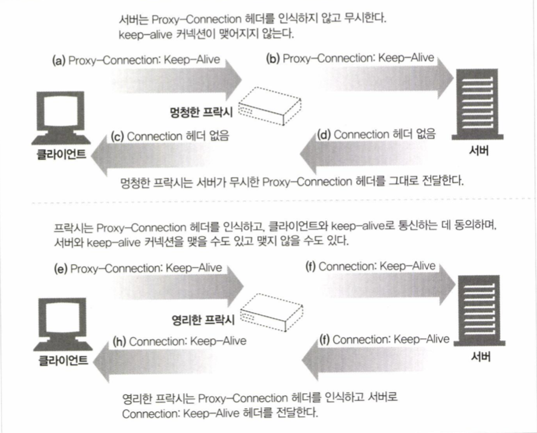

> Connection 헤더 대신 비표준 헤더인 Proxy-Connection 을 대신 사용함으로써 문제를 회피하고자 함. 서버는 Proxy-Connection 헤더는 무시하고 Connection 헤더만 처리하며, 영리한 프락시는 Proxy-Connection 을 Connection 헤더로 바꿔 서버로 전송한다 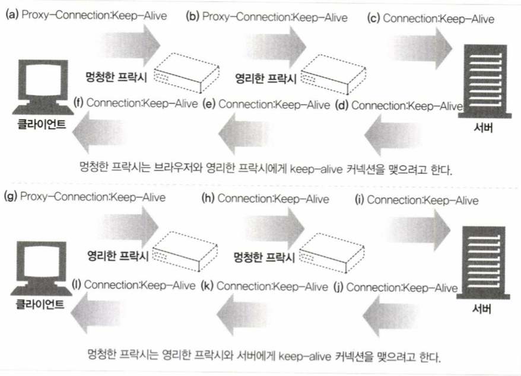 그러나 영리한 프록시와 서버 사이에 멍청한 프록시가 존재한다면? 일반적으로 클라이언트는 네트워크상의 모든 중개 서버의 존재를 알기 힘들기 때문에 Proxy-Connection 해결책이 될 수는 없다 -&gt; 중개 서버 어플리케이션들이 지속 커넥션을 명확히 구현해야 함
>
> ### HTTP/1.1 의 지속 커넥션
>
> * HTTP/1.1 에서는 keep-alive 커넥션 대신 개선된 지속 커넥션을 지원한다
>   * HTTP/1.1 에서는 지속 커넥션이 기본 설정이다 \(default\)
>   * 커넥션을 끊기 위해선 Connection : close 헤더를 명시해야 한다
>   * 역시 보장하지는 않는다
>
>     **지속 커넥션의 제한과 규칙**
> * 클라이언트가 Connection : close 헤더를 포함한 요청을 보낸 뒤에는 추가 요청이 불가능하다
> * 추가 요청이 없다면 마지막 요청에 Connection : close 헤더를 포함시켜야 한다
> * 커넥션의 모든 메세지가 자신의 정확한 길이 정보를 포함하고 있을 때만 가능하다
> * HTTP/1.1 프록시는 클라이언트와 서버 각각에 대해 별도의 지속 커넥션을 관리해야 한다
> * HTTP/1.1 프록시 서버은 클라이언트가 지원 가능한 커넥션 관련 기능에 대해 알지 못하는 경우 지속 커넥션을 맺으면 안된다
> * HTTP/1.1 어플리케이션은 중간에 끊어지는 커넥션을 복구할 수 있어야 한다
> * 커넥션이 끊어졌을 때 클라이언트는 반복 요청에 대한 문제가 없는 경우 요청 재전송이 가능해야 한다
> * 하나의 클라이언트 당 2개 이하의 지속 커넥션을 유지해야 한다

## 4.6 파이프라인 커넥션

* HTTP/1.1 은 지속 커넥션을 통해 요청을 파이프라이닝 할 수 있다
  * 응답이 도착하기 전까지 요청들은 큐에 쌓인다
  * 이전 요청의 응답을 기다리지 않고 다음번 요청을 바로바로 전송한다
  * 네트워크를 왕복하는 시간을 줄여 성능을 향상시킨다

> 네 개의 트랜잭션을 처리하는 커넥션들

* 파이프라인 커넥션의 제약사항
  * HTTP 클라이언트는 커넥션이 지속 커넥션인지 확인하기 전까지 파이프라인을 이으면 안된다
  * HTTP 응답순서는 요청 순서와 같아야 한다
  * HTTP 클라이언트는 예상치 못하게 끊어진 커넥션을 다시 맺고 요청을 보낼 준비가 되어야 한다
  * non-idempotnet 메서드 요청은 파이프라인을 통해 보내면 안된다
    * 클라이언트는 에러 발생 시 어떤 요청들이 이미 처리되었는지 알 수 가 없다

## 4.7 커넥션 끊기에 대한 미스테리

**커넥션 관리에는 명확한 기준이 없다**

### 마음대로 커넥션 끊기

* TCP 전송 커넥션은 언제든 끊을 수 있다
  * 어디서, 어느 시점에 끊어질지 확실하게 보장할 수 없음

    **Content-Length 와 Truncation**
* HTTP 응답은 본문의 크기 값을 가지는 Content-Length 헤더를 가지고 있어야 한다
  * 일부 HTTP 서버의 경우 Content-Length 를 생략하거나 잘못된 값을 전달하고 커넥션을 끊는 경우가 있음
  * 클라이언트나 프록시는 실제 전달된 Entity 의 길이와 Content-Length 값이 다르면 서버에 다시 물어봐야 함
  * 프록시의 경우 응답을 캐시하면 안됨
    * 위 사례와 같은 잠재적인 에러를 방지하기 위해

      **커넥션 끊기의 허용, 재시도, 멱등성**
* 커넥션은 언제든 끊어질 수 있기 때문에 HTTP 어플리케이션은 그 시점에 적절히 대응할 준비가 되있어야 한다
  * 클라이언트 입장에서는 응답이 오기 전에 커넥션이 끊기면 서버에서 얼마나 처리되었는지 알 수가 없다
    * non-idempotnet 한 요청들의 경우 반복 시 어떤 부작용이 일어날지 모름
    * 이러한 요청들은 자동으로 재시도하면 안된다
  * 파이프라인 요청은 idempotnet 한 요청만 보내야 한다

    **우아한 커넥션 끊기**
* TCP 커넥션은 양방향 커넥션이다

> TCP 커넥션의 양쪽에는 각각의 입/출력 큐가 존재한다 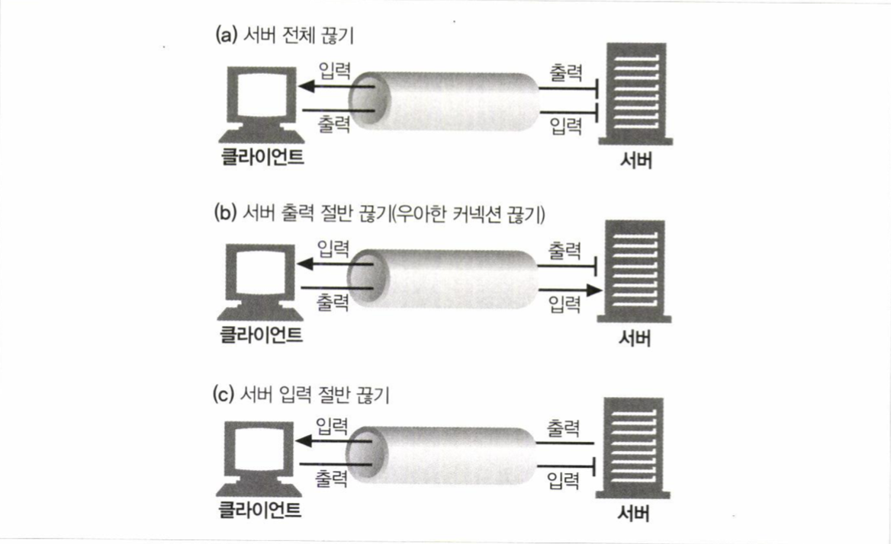 어플리케이션은 TCP 커넥션의 입/출력 채널을 선택적으로 끊을 수 있다
>
> * close\(s\)
>   * 입력과 출력채널 모두를 끊는다
> * shoutdown\(s, \)
>   * 입력, 출력 채널 중 하나를 끊는다
>     * TCP 끊기와 리셋 에러
> * 예상치 못한 쓰기 에러를 예방하기 위해 절반 끊기를 사용해야 한다
>   * 일반적으로 출력 채널을 끊는 것이 안전하다
> * 클라이언트로부터 더 이상 요청이 오지 않을 것임을 확신하지 못하는 이상 입력 채널을 끊는 것은 위험하다
>   * 클라이언트 입장에서 rst 메세지를 받을 경우 운영체제는 버퍼의 읽히지 않는 데이터를 모두 삭제할 수 있다
>     * 우아하게 커넥션 끊기
> * 출력 채널을 먼저 닫고 반대편 출력 채널이 끊기는 것을 기다린다
>   * 더 이상의 데이터 전송이 없을 것임을 알림
> * 서로가 절반 끊기를 구현하고 있다는 보장이 없고, 우아한 커넥션 끊기 프로세스를 따른다는 보장도 없다
>   * 출력 채널을 닫은 뒤에도 입력 채널에 대한 상태 검사를 주기적으로 해야 함

