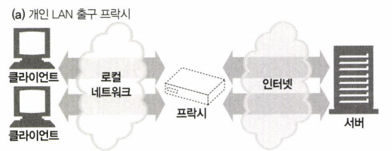
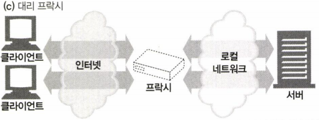
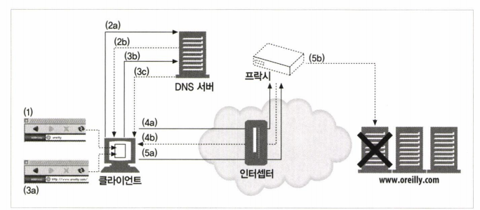
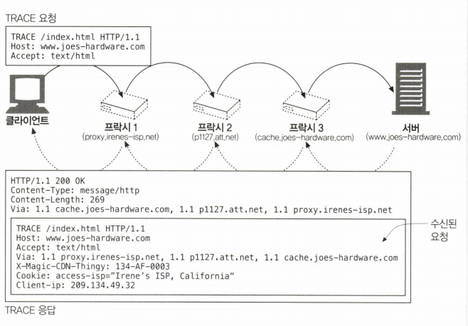
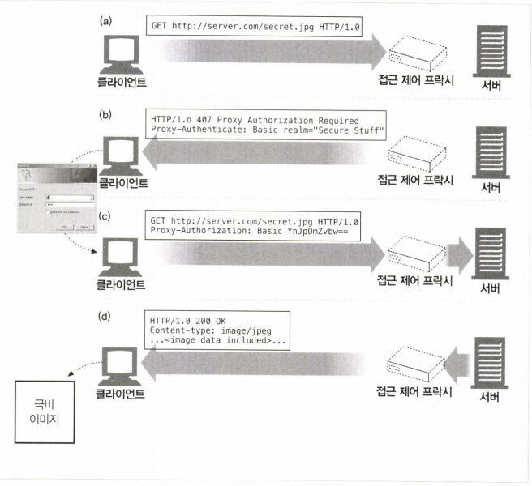
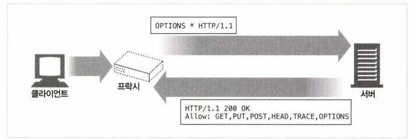

# 06. 프락시

> 중개자, 브로커, 대리인, surrogate

* 서버와 클라이언트 사이에 Application Layer \(L7\) 레벨로 존재
  * 서버, 클라이언트 역할을 동시에 수행한다.
  * 하나의 연결을 양쪽으로 연결하므로 포트가 2개 필요
* 하드웨어, 소프트웨어 또는 그 둘 모두를 칭하는 말.

## 공용 프록시 vs 개인 프록시

* 공용 프록시
  * 대부분의 프록시
  * 캐시 프록시 등 \(이용자가 많을 수록 유리\)
* 개인 프록시
  * 하나의 클라이언트와만 작동하는 경우
  * 주로 클라이언트에서 직접 실행되는 SW
    * 브라우저 보조 앱 \(성능 개선 등\)
    * 취약점 분석 \(Burp Suite\) 등

## 프록시 vs 게이트웨이

둘 다 클라이언트와 서버 사이에 대리자 역할을 수행한다.

원칙적으로는 아래와 같다.

* 프록시 : 같은 프로토콜 간의 연결
* 게이트웨이 : 서로 다른 프로토콜 간의 연결

> 그러나 프락시 서버가 SSL 보안 프로토콜, SOCKS 방화벽, FTP 접근, 웹 어플리케이션 기능도 지원해주면서 게이트웨이 역할도 하게 됨. \(경계가 모호\)

## 프록시 용도

서버, 클라이언트와 독립적으로 존재함으로써 얻을 수 있는 이득을 위해 사용된다.

> 보안, 성능, 비용

### 컨텐츠 필터링

성인물 등을 자체 기관이나 ISP에서 필터링.

> 보통 출구 프락시로 배치하여 사용. \(다음 절에서 후술\)

### 접근 제한 \(문서 접근 제어자\)

> Pulse Secure 같은 앱

특정 서버는 정해진 프록시 서버로부터만 요청을 받아들이도록 설정한다.

클라이언트는 그 프록시 서버를 거치지 않으면 접속할 수 없다.

### 트래픽 감시, 수정

모든 데이터 흐름이 특정 프록시들을 거쳐가게 함으로써 트래픽 감시하거나 부하 컨트롤

#### 보안 방화벽

바이러스나 불량 이용자 등에 대해 트래픽을 차단하거나 수정할 수 있다.

* DDoS 공격을 프록시로 차단
* 웹 방화벽\(WAF\) 같은 앱이 SQL Injection, XSS 등의 공격을 탐지하고 차단 등

### 웹 캐시

* static 리소스와 같이 캐싱하기 쉬운 자료나 캐싱하고 싶은 자료
* 프록시 캐시 서버에 리소스를 보관하고
* 모든 유저가 프록시 캐시를 거치게 하면
* 불필요한 요청을 줄이고 빠르게 통신할 수 있다.

> 대표적인 예 : CDN

### 리버스 프록시

> 서버 가속기, 대리\(Surrogtate\) 프록시

서버가 연결을 받을 때 무조건 거치게 앞에 두는 프록시.

* 프록시 캐시
* 보안 용도 : 예를 들어, 내부 DB 등 주요 서버와 분리하기 위해 사용할 수 있다.
* 부하 분산을 위해 로드 밸런싱 등

### 콘텐츠 라우터

프록시는 인터넷 트래픽 조건과 컨텐츠 종류에 따라 요청을 특정 웹서버로 유도\(Route\)하게 끔 동작할 수도 있다.

> 대표적인 예 : CDN

### 트랜스 코더

서버가 클라이언트에 전달하기 전에 본문 포맷을 프록시가 수정할 수 있다. \(컨텐츠의 변형\)

* 텍스트 파일을 압축하거나
* GIF 파일을 JPG 파일로 변환하거나
* 번역하거나 등

### 익명화 프록시 \(Anonymizer\)

신원을 식별할 수 있는 `IP 주소, From 헤더, Refer 헤더, 쿠키, URI 세션 아이디 등` 을 제거, 수정 할 수 있다.

## 프록시의 위치

프록시는 클라이언트와 서버 사이에 어디든 배치할 수 있다.

주로 어디에 무슨 용도로 배치되는지 알아보겠다.

### {LAN의} 출구 프록시

클라이언트 기준에서 로컬 네트워크와 외부 네트워크 사이

> 보안, 컨텐츠 필터링 등

### {ISP 기준의} 접근 프록시 \(입구 프록시\)

ISP가 ISP 기준의 입구에 두는 프록시

> 트래픽 제어, 캐시 프록시 등

### {서버의} 대리 프록시 \(리버스 프록시로 많이 불린다.\)

웹 서버 바로 앞에서 웹 서버 인 것 처럼 행세한다.

> 트래픽 제어, 컨텐츠 라우팅, 보안 등

### 네트워크 교환 프록시

인터넷의 네트워크와 네트워크 사이에 존재할 수 있다.

예를 들면 모 국가에서 인터넷 트래픽을 감시할 용도로 트래픽이 비싼 곳에 배치할 수 있다.

> 트래픽 감시, 제어, 캐시

## 프록시 계층, 연쇄

프록시는 위 그림처럼 정적으로 라우팅 될 수도 있고 동적으로 될 수도 있음.

* \(= 하나의 부모에게만 요청하지 않음\)

### 동적 부모 선택 예시

#### 부하 균형

작업량 수준에 근거하여 부모를 선택

#### 지리적 인접성에 근거

원 서버의 지역을 담당하는 부모 선택

#### 프로토콜 / 타입에 근거

URI에 근거하여 다른 부모나 원 서버에 라우팅 할 수 있음

#### 가입자 별 라우팅

돈을 더 낸 사람은 더 빠른 길이나, 압축 등의 기술을 포함하여 성능을 높일 수 있음.

## 프록시는 어떻게 트래픽을 받는가?

### 클라이언트를 수정하는 경우

수동 혹은 자동으로 브라우저에 프록시를 설정할 수 있다.

지정되어 있다면 해당 원 서버가 아닌 프록시로 보내게 된다.

> 브라우저 또는 브라우저 보조 프로그램, 클라이언트 앱 등

#### 브라우저가 프록시를 설정하는 방법

* 수동 설정 \(명시적 설정\)
* 브라우저 기본 설정 \(배포자가 임의로 미리 설정해 놓을 수 있음\)
* PAC : 프록시 자동 설정 \(Proxy auto configuration\)
  * 옛 브라우저 Netscape Navigator 에서 소개된 설정 파일로 javascript 문법으로 된 프록시 설정 파일 \(\*.pac 파일\)
    * mime type : application/x-ns-proxy-autoconfig
  * 정해진 javascript 문법에 맞게 작성하면 이에 맞게 자동으로 프록시에 접근
    * 예시\)

      
  * 수동 설정은 하나의 서버만 지정할 수 있는데 반해서 PAC은 상황에 맞게 유연하게 대처함.
  * WPAD \(Web Proxy Auto-Discovery\)
    * PAC 파일을 다운 받을 수 있는 설정 서버를 자동으로 찾는 기법
      * 동적 호스트 발견 규약 \(DHCP\)
      * 서비스 위치 규약 \(SLP\)
      * DNS 잘 알려진 호스트 명
      * DNS SRV 레코드
      * DNS TXT 레코드 안의 서비스 URI 등

### 네트워크를 수정하는 경우 \(인터셉트 프록시, 투명 프록시\)

네트워크 인프라 상에서 스위치나 라우터를 수정하여 클라이언트 몰래 트래픽을 가로챌 수 있다.

클라이언트는 이 프록시가 존재한다는 것을 알 방법이 없다.

### DNS 에서 namespace를 수정하는 경우

웹 서버의 이름과 IP 주소를 리버스 프록시가 대신 사용하여 모든 요청을 프록시가 받을 수 있다.

### 웹 서버를 수정하는 경우

리버스 프록시를 사용하는 웹 서버가 305 redirect 를 내려 리버스 프록시로 다시 접근하도록 설정할 수 있다.

## 클라/서버와는 다른 프록시의 미묘한 특징들

### 부분 URI vs 전체 URI

#### 원 서버 : 부분 URI 요청

굳이 스킴과 호스트 등을 낭비하여 넣을 필요가 없다.

> 패킷보면 호스트랑 포트가 따로 있으니까

#### 프록시로의 요청 : 전체 URI 요청

목직지를 식별해야 하므로 \(패킷까지는 보지 못하나 보다\)

#### 그렇다면 프록시가 부분 URI 를 받는다면?

* Host 헤더를 보고 없다면 Host 헤더를 포함하도록 요청한다. \(400 Bad Request 에러를 내려줌\)
  * 가상 호스팅의 경우도 똑같이 작동
* 그러므로 http/1.1 부터는 모두 host 헤더를 포함하게 되었다. \(없으면 400 에러\)

### 전송 중 URI 변경이 일어날 수 있다.

그러나 HTTP 프로토콜에 :80을 명시적으로 붙이는 등의 당연한 일도 치명적인 문제를 야기할 수 있으므로 빈 경로를 /으로 대체하는 것을 제외하고는 안 하는 것이 좋다.

### URI 클라 자동확장 & 호스트네임 분석

> 지금은 사용되지 않는 듯 하다

URL 자동 확장은 2장에 설명한 내용과 같이 yahoo 라고 입력하면 www. 와 .com 을 자동으로 붙여서 dns 에 lookup 하고 호스트가 존재하면 자동으로 www.yahoo.com 으로 연결해주는 기법.

그러나 현대에는 모든 키워드를 검색 엔진으로 검색한다.

#### 명시적인 프록시가 있는 경우 자동확장?

목적지가 무조건 프록시를 향하므로 dns lookup 시에 프록시의 주소를 lookup 하게 됨.

* 원치 않는 lookup 성공.
* 원치 않게 자동확장이 이루어지지 않음.

#### 인터셉터 프록시가 있는 경우 자동확장?

## 메시지 추적

현대의 커넥션은 수 많은 프록시를 거치게 되는데 흐름을 어떻게 추적하고 문제점을 어떻게 찾아낼까?

### Via 헤더

중간 노드 \(프록시나 게이트웨이\) 를 지날 때마다 Via 헤더에 중간 노드 정보가 추가된다.

그러므로 일반적으로 요청과 응답은 같은 \(순서만 반대인\) Via 헤더를 갖는다.

#### protocol-name

HTTP 인 경우 생략 가능

#### host 명

숨기고자 한다면 가명으로 대체할 수 있다.

**가명을 그룹핑 할 수 있다.**

같은 프로토콜, 같은 조직 통제하에 있고, 가명으로 교체되어 있는 경우에만

하나의 프록시 인 것처럼 대체할 수도 있다.

이는 네트워크 내부 설계 등이 노출됨으로써 보안이 깨지는 것을 방지한다.

웬만하면 모든 프록시는 via 헤더\(경유지 목록\)를 유지하고자 노력해야 한다.

#### pseudonym

벤더나 버전 정보, 이벤트 진단 정보 등을 사용하는 노드 코멘트

### Server 헤더

원 서버에 의해 사용되는 소프트웨어 정보가 헤더에 추가된다.

프록시는 Server 헤더를 수정해서는 안된다.

### TRACE 메서드

각 프록시를 지나면서 어떻게 메시지를 수정하는지 흐름을 확인\(디버깅\)할 수 있다.

> 불행하게도 잘 구현되어 있지 않다.

서버는 메시지가 도착하면 요청 메시지를 본문에 담아 다시 돌려보낸다.

#### MAX-Forwards 헤더

프록시는 자신이 메시지를 받을 때마다 MAX-Forwards 헤더를 1씩 감소시키고 0인 헤더를 받으면 `자신이 원 서버가 아니더라도` 클라이언트에게 곧장 답신해야 한다.

프락시 연쇄의 어떤 특정 홉의 요청을 보기 위해서 이용할 수도 있다.

## 프록시 인증

접근 통제 목적의 프록시는 Proxy-Authenticate 헤더를 통해 어떻게 접근해야 하는 지 알려준다.

## 프록시 상호운용성

### 기본적인 룰

* 지원하지 않는 확장 헤더는 그대로 냅둔다. \(멍청한 프록시처럼\)
  * 왜 hop-by-hop header 와 end-to-end header 는 따로 구분하지 않을까?
* 같은 이름의 여러 헤더 필드의 순서도 유지해주어야 한다.
* 확장 메서드 역시 그대로 넘긴다.

### OPTIONS : 어떤 기능을 지원하는지 묻기

보다 쉽게 상호작용할 수 있게 OPTIONS 메서드로 물어볼 수 있다.

서버는 Allow 헤더를 통해 가능한 기능을 응답한다.

더 많은 헤더를 응답하고 이를 받을 수 있지만 표준은 Allow 하나 뿐.

프록시는 Allow 헤더를 수정해선 안된다. \(지원하지 않더라도 경로는 언제든지 바뀔 수 있기 때문\)

